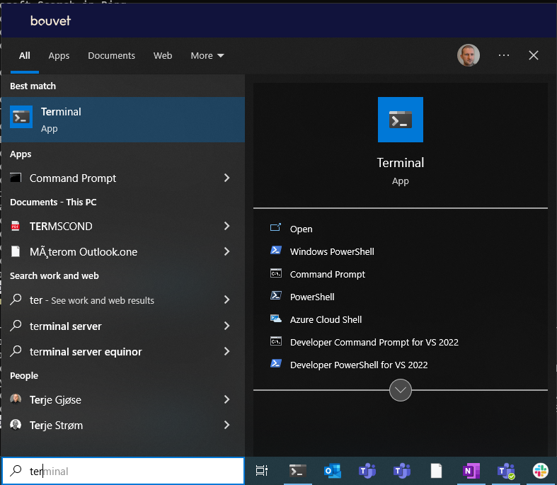
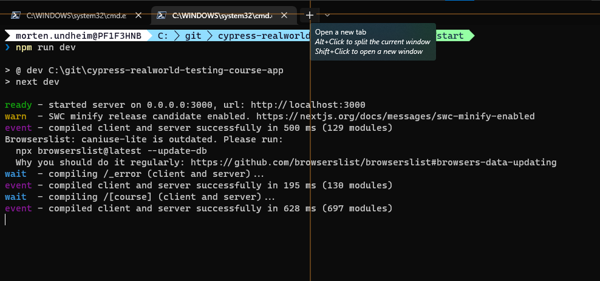
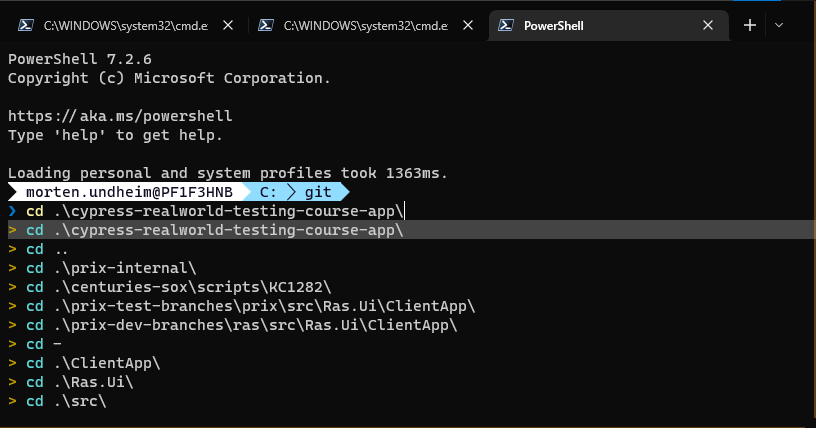
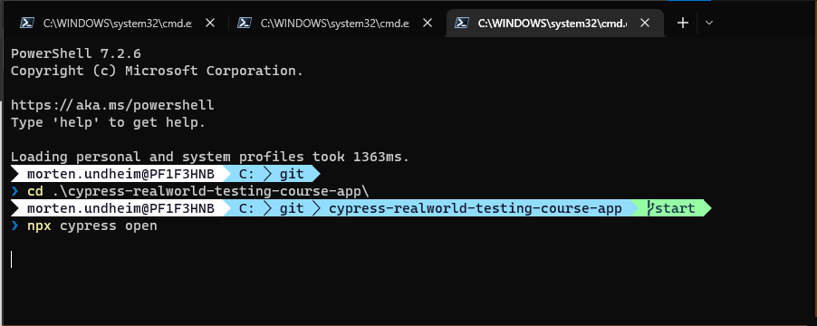
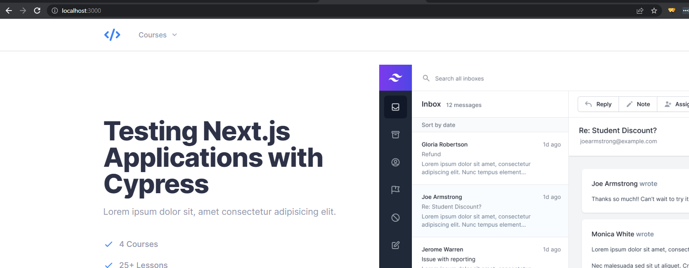
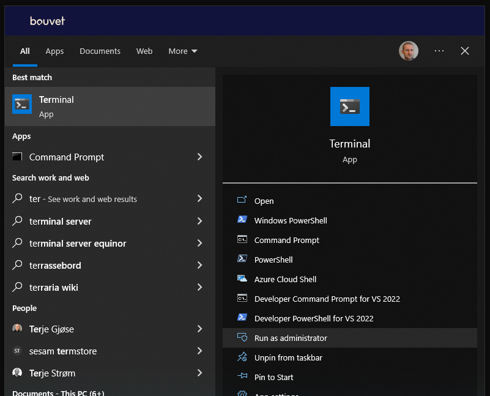
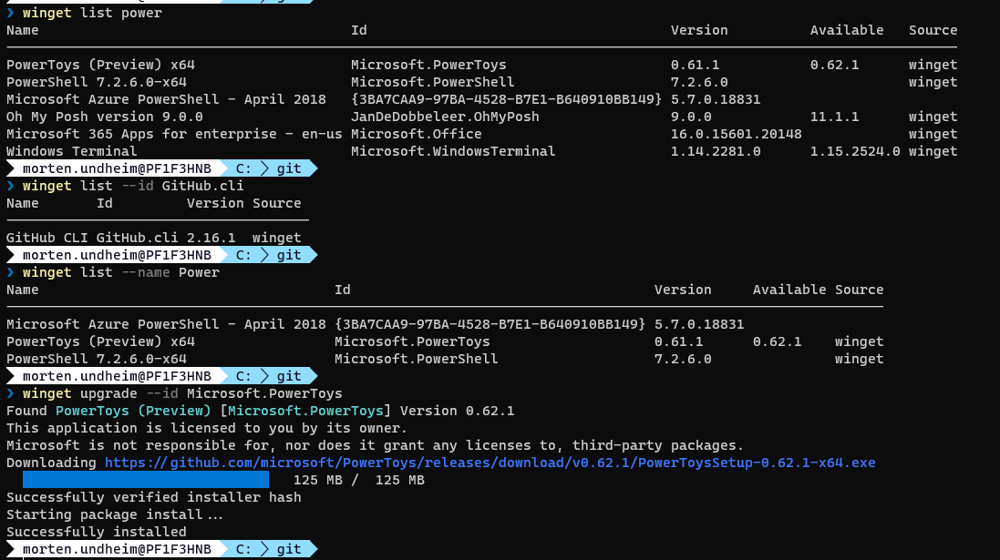

# cypress
https://www.cypress.io/ information
# Cypress tool end to end testing in Prix+ <!-- omit in toc -->

## Table of contents <!-- omit in toc -->

- [cypress](#cypress)
  - [Introduction](#introduction)
  - [Windows terminal](#windows-terminal)
  - [visual studio code](#visual-studio-code)
  - [NodeJS](#nodejs)
  - [git](#git)
  - [github cli](#github-cli)
  - [Cypress course code installation](#cypress-course-code-installation)
  - [Tips and recommendations](#tips-and-recommendations)
    - [winget](#winget)
    - [add completion to winget](#add-completion-to-winget)
    - [Windows terminal administrator mode](#windows-terminal-administrator-mode)
    - [examples of winget usage](#examples-of-winget-usage)
    - [nvm tool can be installed if you need to switch between several versions of node](#nvm-tool-can-be-installed-if-you-need-to-switch-between-several-versions-of-node)
    - [node installation by using nvm (including npm tool) for Cypress course (latest Long Term Support)](#node-installation-by-using-nvm-including-npm-tool-for-cypress-course-latest-long-term-support)
    - [Optional npm add-on](#optional-npm-add-on)
    - [windows powershell addons](#windows-powershell-addons)

## Introduction

We start by installing tools that are needed to run the course.
This part is replacing the part in the course that describe needed tool installation. The reason for replacing it, is to try to create a more complete and easy to follow installation guide.
The installation is based on using windows terminal as the cmd line tool.
Winget is used as the main installation tool.

## Windows terminal

Open a windows terminal window like this and select "Powershell":



## visual studio code

Check if already installed:

  ```powershell
  winget list --id Microsoft.VisualStudioCode
  ```

If not already installed, you can install by running:

  ```powershell
  winget install --id Microsoft.VisualStudioCode
  ```

## NodeJS

Check if you have NodeJs installed

  ```powershell
  node -v
  ```

If it is installed you get information about what version is installed.
Now goto the download page and select the LST version, download and install IF you did not get any results from the command above or have an older version installed:
<https://nodejs.org/en/>

## git

Check if you have git installed
  ```powershell
  git --version
  ```

If not installed, install by:

  ```powershell
  winget install --id Git.Git
  ```

## github cli

Check if installed:
  ```powershell
  winget list --id GitHub.cli
  ```

If result is "No installed package found matching input criteria.", install by:
  ```powershell
  winget install --id GitHub.cli
  ```

Check gh auth status:

  ```powershell
  gh auth status
  ```

Ok status should look something like this:


If error message, start interactive [gh auth login](https://cli.github.com/manual/gh_auth_login) by:

  ```powershell
  gh auth login
  ```

## Cypress course code installation

Now you need to go to the folder where you want to download git repositories
Here is an example on how to go to the c:\ folder and create a "git-repos" folder:

  ```powershell
  cd c:\
  md git-repos
  ```

Goto folder where you want the course repo downloaded and clone the course repo.

  ```powershell
  cd c:/git-repos
  gh repo clone cypress-io/cypress-realworld-testing-course-app -- --branch start
  ```

Goto the project folder and install the npm modules needed to run the application:

  ```powershell
  cd cypress-realworld-testing-course-app
  del package-lock.json
  npm install
  ```

The del (delete) command above is added to fix something that seems to be an inconsistency (I will add and issue on the course repo). The file is regenerated by the npm install command.

Add cypress to the app project:

```powershell
npm install cypress --save-dev
```

Open the project files in Visual studio code:

```powershell
code .
```

The course instruct to run command line commands in terminal windows in Visual Studio Code. The terminal windows included in Visual Studio Code is basically doing the same job as the "standalone" terminal window we have used in this guideline.

Now it is time to start the application you are going to test against:

```powershell
npm run dev
```

Now the application has started and you cannot run any more commands in your command window until the application has been stopped:


So then we open a new terminal window to run other commands:



and go to the project folder:



You will use this terminal window when you soon in the course are asked to open the cypress test gui by running this command:



Now it is time to open the application you have started in the browser by entering localhost:3000 in the address bar:



The preparations for the course are done, and now you should head over to and follow the course documentation frome here:

[Start course from here](https://learn.cypress.io/testing-your-first-application/app-install-and-overview#app-overview
)

## Tips and recommendations

### winget

We use [winget](https://learn.microsoft.com/en-us/windows/package-manager/winget/) to install and upgrade tools

### add completion to winget

<https://github.com/microsoft/winget-cli/blob/master/doc/Completion.md>

### Windows terminal administrator mode

If you are asked to run windows terminal in administrator mode:



### examples of winget usage

check what is installed and upgrade examples (just to give an idea of what it can be used for):



### nvm tool can be installed if you need to switch between several versions of node

Install [nvm](https://github.com/coreybutler/nvm-windows):

  ```powershell
  winget install --id CoreyButler.NVMforWindows
  ```

### node installation by using nvm (including npm tool) for Cypress course (latest Long Term Support)

[NB! you need to start windows terminal in admin mode to run this installation](#administrator-mode)

  Install latest verson of Long Time Support version of node:

  ```powershell
  nvm install lts
  ```

### Optional npm add-on

If you run npm commands very often, install this module globally to make life easier, ref. [organizing npm scripts](https://glebbahmutov.com/blog/organize-npm-scripts/) and [npm-quick-run](https://github.com/bahmutov/npm-quick-run):

```powershell
  npm i -g npm-quick-run
  ```

### windows powershell addons

  ```powershell
  winget install --id JanDeDobbeleer.OhMyPosh
  code $PROFILE
  ```

Add these lines to the file:

  ```powershell
  #-----------------------------------------------------------
# Prompt theme engine
# https://ohmyposh.dev/
#-----------------------------------------------------------
Import-Module posh-git
oh-my-posh init pwsh --config "$env:POSH_THEMES_PATH\paradox.omp.json" | Invoke-Expression

#-----------------------------------------------------------
# Scrolling/searching through history
#-----------------------------------------------------------
Import-Module PSReadLine
Set-PSReadLineOption -PredictionSource HistoryAndPlugin
Set-PSReadLineOption -PredictionViewStyle ListView
Set-PSReadLineOption -EditMode Windows
Set-PSReadLineOption -EditMode Windows
Set-PSReadLineOption -EditMode Windows
Set-PSReadLineKeyHandler -Key UpArrow -Function HistorySearchBackward
Set-PSReadLineKeyHandler -Key DownArrow -Function HistorySearchForward
  ```

You will get a nice informal command prompt and history features when writing a command.

You see the path you are located in, the git branch name (start) and the last "cd" command you ran:


