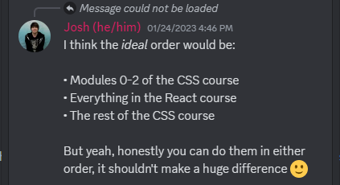

# Front end development

## Links

[Josh Comeau](https://www.joshwcomeau.com/)

## Courses

### CSS

[CSS for JavaScript Developers](https://css-for-js.dev/)

### React

[The Joy of React](https://www.joyofreact.com/)

[Workshop: Praktisk React med Typescript](https://www.bouvet.no/kurs/kategorier/utvikling-for-web-og-mobil/workshop-praktisk-react-med-typescript)

### Notes

Recommendation for combining the `CSS for JavaScript Developers` and `The Joy of React` courses:

