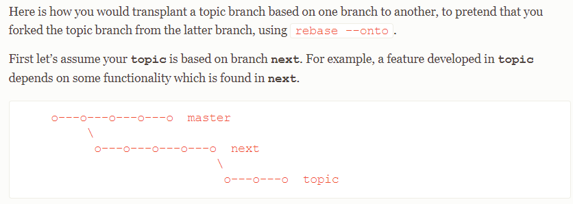
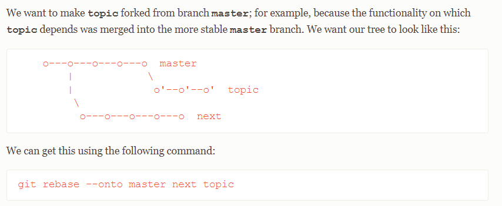
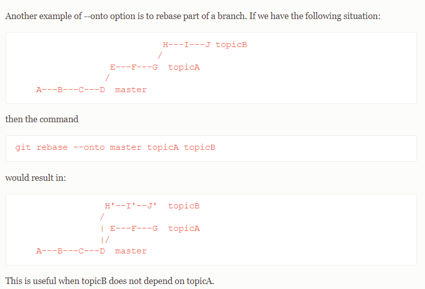

# Git

[autocomplete](https://github.com/dahlbyk/posh-git)
## rebase

[git-rebase](https://www.atlassian.com/git/tutorials/rewriting-history/git-rebase)

## basing new branch on another that is not merged yet

You have finished the "next" branch, created a pr that is not approved yet and started working on topic:

Then after "next" pr has been approved and merged into "master", you can move the "topic" branch to be rebased on "master" like this:

## rebase part of branch to be merged into "master"

